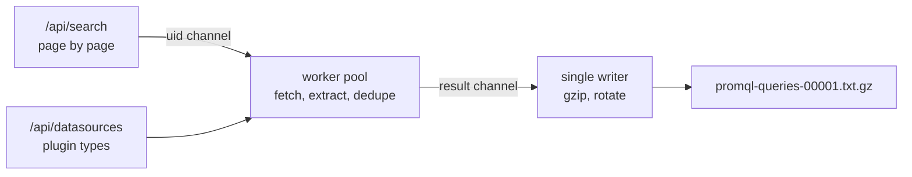

# grafana-dashboard-extractor

Extract the PromQL queries from every dashboard of a Grafana instance into a flat file.

Output is one query per line, prefixed by the dashboard UID and a semicolon:

```
cdf6f5b7;sum(rate(http_requests_total[5m]))
a1b2c3d4;http_requests_total{job="api-server"}
```

Only queries backed by a Prometheus-family datasource are included. Loki, CloudWatch,
Elasticsearch and other query languages are filtered out by resolving each panel's and
target's datasource reference to a concrete plugin type. Panel targets and annotation
queries are both extracted, since Grafana runs both against the datasource.

## Install

Download a binary for your platform from the [releases page](https://github.com/felixbarny/grafana-dashboard-extractor/releases),
or build from source:

```bash
go install github.com/felixbarny/grafana-dashboard-extractor@latest
```

The binary is statically linked with no runtime dependencies.

## Usage

```bash
export GRAFANA_URL=https://grafana.example.com
export GRAFANA_TOKEN=glsa_xxxxxxxx

grafana-dashboard-extractor
```

That writes `promql-queries.txt.gz` and reports progress on stderr:

```
 24.9% | 12,431/50,000 dashboards | 84,203 queries | 61/s | 3m22s | ~10m left
```

More examples:

```bash
# A sample of 500 dashboards, uncompressed
grafana-dashboard-extractor --max-dashboards 500 --compress=false -o sample.txt

# Split a large instance into files of 10k dashboards each
grafana-dashboard-extractor --dashboards-per-file 10000

# Basic auth instead of a service account token, restricted to one folder
grafana-dashboard-extractor --user admin --password secret --folder-uid abc123
```

### Credentials

A service account token is the recommended option. A **Viewer** role is enough: the tool
only reads dashboards and datasource metadata.

| Flag | Environment variable |
| --- | --- |
| `--url` | `GRAFANA_URL` |
| `--token` | `GRAFANA_TOKEN` |
| `--user` | `GRAFANA_USER` |
| `--password` | `GRAFANA_PASSWORD` |
| `--org-id` | `GRAFANA_ORG_ID` |

Prefer the environment variables so credentials do not end up in your shell history.

### Options

Run `grafana-dashboard-extractor --help` for the full list. The ones that matter most:

| Flag | Default | Purpose |
| --- | --- | --- |
| `--max-dashboards`, `-n` | `0` (all) | Stop after this many dashboards |
| `--dashboards-per-file` | `0` (one file) | Split the output every N dashboards |
| `--compress` | `true` | gzip the output and append `.gz` |
| `--output`, `-o` | `promql-queries.txt` | Output path |
| `--append` | `false` | Add to existing output files instead of replacing them |
| `--concurrency`, `-c` | `8` | Dashboards fetched in parallel |
| `--page-size` | `1000` | Dashboards per search request, max 5000 |
| `--datasource-types` | `prometheus,grafana-amazonprometheus-datasource,grafana-mimir-datasource` | Plugin types treated as PromQL sources |
| `--include-unresolved` | `true` | Keep queries whose datasource cannot be resolved |
| `--dedupe` | `true` | Drop repeated identical queries within a dashboard |
| `--anonymize` | `false` | Replace the identifiers of every query with pseudonyms |
| `--start-page` | `1` | Resume an interrupted run at a later search page |
| `--progress` | `auto` | `auto`, `always` or `never` |

An interrupted run reports the page it stopped on. Resume it without losing what was
already written by combining `--start-page` with `--append`:

```bash
grafana-dashboard-extractor --start-page 7 --append
```

With `--dashboards-per-file`, the resumed run continues the numbering rather than reopening
the last file, so files a consumer already picked up are never modified. The file the
interrupted run was working on keeps whatever it holds and stays below the limit.

## Output format

Each line is `<dashboard-uid>;<query>`. Split on the **first** semicolon only: a PromQL
label value may legitimately contain one, while a dashboard UID never does.

```bash
zcat promql-queries.txt.gz | cut -d';' -f2-          # queries only
zcat promql-queries.txt.gz | cut -d';' -f1 | uniq -c # queries per dashboard
```

Multi-line expressions are collapsed onto a single line, so every query occupies exactly
one line. Dashboards are fetched concurrently, so line order is not stable across runs.
Dashboards without PromQL queries contribute no lines.

## Sharing the output

Queries name what an organization runs. `--anonymize` replaces every identifier with a
pseudonym, so the output can be handed to someone outside it:

```bash
grafana-dashboard-extractor --anonymize -o shareable.txt
```

```
dash_9e3a17b204;sum by (label_1f7c4a0e83) (rate(metric_5b8d02c9a1{label_44e1b7cd90=~"$var_7c0a91fe32"}[$__rate_interval]))
```

Metric names, label names, label values, dashboard variable names and dashboard UIDs are
replaced. What is the same in every Grafana instance is kept, so the queries stay worth
analyzing: functions, aggregations, operators, durations, numbers, regular expression
syntax, the reserved labels `le` and `quantile`, and Grafana's own `$__rate_interval` and
friends. An identifier maps to the same pseudonym everywhere in the output, so grouping and
counting still work.

The mapping is a salted digest, and the salt is random per run and never written down, so
nobody can turn a pseudonym back into a name, not even by guessing likely names. That also
means two runs produce unrelated pseudonyms. To compare runs, or to resume one with
`--append`, supply your own secret and keep it out of your shell history:

```bash
export GRAFANA_ANONYMIZE_SALT=$(openssl rand -hex 32)
grafana-dashboard-extractor --anonymize
```

Two caveats worth knowing before sharing. Anything the tool cannot recognize as PromQL is
pseudonymized rather than kept, so a query in a dialect such as MetricsQL loses the parts
of its syntax that Prometheus does not have. And stderr is not anonymized: `--verbose`
logs real dashboard UIDs for failures.

## How it works at scale

Dashboards are enumerated page by page and fetched by a worker pool that feeds a single
writer, so only `--concurrency` dashboard documents exist in memory at any moment.
Extracting 400,000 dashboards uses the same memory as extracting 50: a live heap of about
1.3 MiB, with a peak of roughly 6 MiB including garbage awaiting collection. Run
`make test-scale SCALE=50000` to reproduce the measurement.

Grafana, not the extractor, sets the pace: against a local Grafana, expect a throughput of
around 600 dashboards per second at the default concurrency. A remote instance answers
slower, and raising `--concurrency` past the default mostly adds load rather than
throughput. The progress line reports the rate a run actually achieves.



Requests that fail with a 429 or a 5xx are retried with exponential backoff, honoring
`Retry-After`. A dashboard that cannot be fetched is counted and skipped rather than
aborting the run; pass `--fail-fast` for the opposite. Interrupting with Ctrl-C flushes
what has been written and prints the summary.

## Datasource resolution

Whether a target is PromQL depends on its datasource, and dashboards reference datasources
in several ways. Resolution happens in this order:

1. The target's own `datasource`, otherwise the enclosing panel's, otherwise the row's,
   otherwise the instance's default datasource.
2. `-- Mixed --` defers to the per-target references. `-- Dashboard --`, `-- Grafana --`
   and `__expr__` never carry PromQL and are skipped, as are `logs` panels.
3. A reference to a dashboard variable (`$datasource`, `${DS_PROMETHEUS}`) is resolved
   through the dashboard's own `templating` list, or through `__inputs` for exported
   dashboards.
4. A literal uid or name is looked up in the instance's datasource list.
5. Only when neither of those yields a type does the `type` recorded in the reference
   itself (`{"type": "prometheus", "uid": "..."}`) decide. A uid is what Grafana resolves
   at query time, so the live datasource list outranks a type that went stale when the
   panel was last pointed somewhere else.

Datasource types come from `/api/datasources`. Tokens that may not read that endpoint fall
back to `/api/frontend/settings`, which exposes the same plugin types to any authenticated
user.

If a reference cannot be resolved at all, for example a bare uid pointing at a deleted
datasource, the expression is kept by default and counted separately in the summary. Use
`--include-unresolved=false` to drop those instead.

Queries inside library panels are not visible in the dashboard document and are therefore
not extracted; the summary reports how many were encountered. Dashboard variable queries
such as `label_values(up, job)` are Grafana functions rather than PromQL and are left out
as well.

## Development

```bash
make build             # build ./bin/grafana-dashboard-extractor
make test-race         # unit tests
make test-integration  # integration tests against a dockerized Grafana
make test-scale        # 50k dashboard memory check
make test-corpus       # validate against the top 1000 grafana.com dashboards
make test-throughput   # time extracting them from a dockerized Grafana
make test-all          # every tier that needs no third-party service
```

The integration tests start a real Grafana with [testcontainers](https://golang.testcontainers.org/),
provision Prometheus, Loki and CloudWatch datasources, upload the dashboard fixtures from
`internal/testsupport/testdata/dashboards`, and assert on the produced files. They are
behind the `integration` build tag and skip themselves when Docker is unavailable. Point
them at another version with `make test-integration GRAFANA_IMAGE=grafana/grafana:11.6.6`.

Unit tests and integration tests share one fixture set and one set of expectations, so a
dashboard added to `internal/testsupport/testdata/dashboards` is covered by both tiers.
Each fixture has a `.expected` file listing the exact output lines it must produce;
regenerate them with `go test ./internal/extract/ -run TestExtractFixtures -update` after
verifying the change is intended.

### Validating against real dashboards

Fixtures only prove the extractor does what its author expected. `make test-corpus`
checks it against the most downloaded dashboards on grafana.com instead, serving them
from a fake Grafana and running the real command over them. Four independent signals
have to agree:

- every extracted query parses as PromQL once Grafana variables are interpolated,
- no extracted query contains a pipe, which PromQL has no operator for and every LogQL
  pipeline stage starts with,
- dashboards that grafana.com lists under Prometheus yield at least one query,
- every `expr` a schema-agnostic walk of the raw JSON finds in a panel target or an
  annotation either appears in the output or has an explicable reason not to.

The last one is what surfaced that annotation queries were being ignored.

The same corpus validates `--anonymize`, by extracting it twice and comparing. No word of a
dashboard may survive in the anonymized output, judged against a vocabulary of public
PromQL and Grafana words assembled from a parser rather than from the anonymizer's own
lists. And a query has to parse the same way before and after, which is what caught `\d`
losing its `d` to a pseudonym, `(?i)` losing its flag, and the unit of `[${__range_s}s]`
being mistaken for a metric name.

The test is behind the `corpus` build tag, so `go test ./...` never runs it and CI never
touches grafana.com. Dashboards are downloaded once, one request at a time with 500 ms in
between, into `.cache/grafana-com`, which `.gitignore` excludes; the first run takes about
ten minutes and later runs are instant. It also leaves the full report and the extracted
queries there for inspection.

```bash
make test-corpus CORPUS=200      # fewer dashboards
make clean-corpus                # drop the cache
CORPUS_REQUEST_INTERVAL=2s make test-corpus
```

`make test-throughput` reuses the same cache for a different question: it uploads the
dashboards into a dockerized Grafana and times the extraction at several concurrencies,
plain and anonymized. It needs both build tags and both prerequisites, Docker and a warm
cache, and it fails only if the settings change what is extracted or the rate collapses.

## License

Apache 2.0
